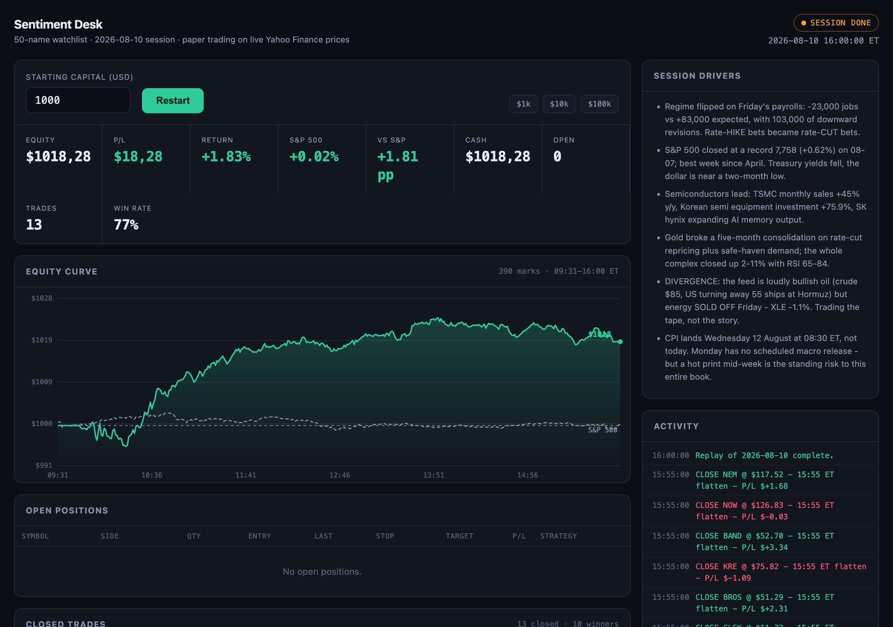

# Apify stock sentiment simulator

A [Claude skill](https://docs.claude.com/en/docs/agents-and-tools/agent-skills/overview) that turns the [Social & Stock News Sentiment](https://apify.com/lofomachines/social-stock-news-sentiment) Apify Actor into a daily trading research loop — plus the paper-trading simulator it hands the result to.

Every morning before the US open the agent pulls ~1,000 scored news and social signals, extracts and validates the tickers, builds a 50-name watchlist with one intraday strategy per name, and arms a simulator that trades it against live prices until the close.

> **Paper trading only.** Fills, positions and P/L exist inside one Python process. There is no order-routing code anywhere in this repository and none is planned. Nothing here is investment advice.



## What actually happens

```
                    ┌──────────────────────────────┐
  07:00 ET          │  Apify Actor (via MCP)       │   ~1,000 scored signals
  ──────────────────▶  social-stock-news-sentiment │   news · Telegram · X · Reddit
                    └──────────────┬───────────────┘
                                   │  datasetId
                    ┌──────────────▼───────────────┐
                    │  extract_tickers.py          │   159 candidates
                    │  build_universe.py           │   → 126 valid US equities
                    │  build_watchlist.py          │   → 50 names, 1 rule each
                    └──────────────┬───────────────┘
                                   │  watchlist.json (frozen, archived)
  09:30–16:00 ET    ┌──────────────▼───────────────┐
  ──────────────────▶  marketsim/server.py         │   live Yahoo prices
                    │  9 intraday rules            │   simulated fills
                    └──────────────┬───────────────┘
                                   │
                    ┌──────────────▼───────────────┐
  after the close   │  skill/scripts/diagnose.py   │   MAE/MFE, exit census,
                    │  references/evidence.md      │   sample-size discipline
                    └──────────────────────────────┘
                                   │
                                   └──▶ feeds tomorrow's selection
```

The interesting half is the last box. Building a watchlist is easy; deciding what a session's results actually license you to change is not, and that discipline is what `references/evidence.md` encodes.

## Prerequisites

- **Python 3.9+** — the simulator uses only the standard library, no `pip install` needed
- **[Claude Code](https://docs.claude.com/en/docs/claude-code/overview)** (or any MCP-capable client)
- **An [Apify account](https://console.apify.com/sign-up)** with an API token
- Sentiment scoring requires a paid Apify plan; on a free account the `sentiment`, `sentiment_score` and `market_impact` fields come back `null` and everything else still works

## Install

### 1. Clone

```bash
git clone https://github.com/Gyploforte/apify-stock-sentiment-simulator.git
cd apify-stock-sentiment-simulator
```

The skill lives in `.claude/skills/sentiment-trading-loop/`, so Claude Code discovers it automatically when you start it from this directory. Nothing to register.

### 2. Connect the Apify MCP server

```bash
apify mcp install claude-code
```

Or wire it up by hand — the server is at `https://mcp.apify.com`:

```json
{
  "mcpServers": {
    "apify": {
      "url": "https://mcp.apify.com",
      "headers": {
        "Authorization": "Bearer <YOUR_APIFY_TOKEN>"
      }
    }
  }
}
```

**Keep the token out of this repository.** It belongs in your MCP client configuration or an environment variable. `.gitignore` already excludes every runtime artefact, but a token pasted into a tracked file would still be committed.

### 3. Check it works

```bash
claude
```

Then ask: *"run the sentiment-trading-loop skill for today's session"*. The skill takes over from there.

## Running the simulator

```bash
cd marketsim
python3 server.py
```

Open <http://localhost:8777>, enter a starting amount, press **Start**.

- Market **open** → trading begins immediately
- Market **closed or pre-market** → the engine arms itself and starts automatically at 09:30 ET
- **Stop** flattens every position at the last known price

The dashboard shows the equity curve against the S&P 500, open positions with their stops and targets, a closed-trade blotter, and a **live scan** telling you what every unfilled name is currently waiting for — which matters, because for the first twenty minutes of a session nothing trades and a silent screen looks identical to a dead engine.

### Replay a past session

```bash
python3 backtest.py --date 2026-08-10 --capital 1000
```

Same engine, only the clock and bar feed swapped. To load a replay straight into the UI:

```bash
python3 server.py --demo 2026-08-10
```

### Post-mortem

```bash
python3 ../.claude/skills/sentiment-trading-loop/scripts/diagnose.py . 2026-08-10
```

It reports the exit-reason census, MAE/MFE excursions, mean *and* median trade returns, bucket concentration, and net exposure — then tells you whether the sample supports any conclusion at all. It usually doesn't, and saying so is the point.

## Scheduling it for every morning

The skill runs when an agent invokes it, so "every morning" means scheduling the agent. Three options, easiest first.

### Option A — Claude Code scheduled tasks

If your Claude Code build has scheduled tasks, this is the least moving parts. Ask Claude:

> Schedule the sentiment-trading-loop skill to run every weekday at 07:00 America/New_York, and arm the simulator with $1000.

### Option B — cron (Linux, macOS)

`scripts/morning-run.sh` wraps the whole thing. Make it executable:

```bash
chmod +x scripts/morning-run.sh
```

Then add a weekday entry. Cron uses your machine's local time, so convert 07:00 ET yourself — the example below is for a machine on Central European Time, where 07:00 ET is 13:00 CET:

```bash
crontab -e
```

```cron
0 13 * * 1-5 cd /path/to/apify-stock-sentiment-simulator && CAPITAL=1000 ./scripts/morning-run.sh
```

Logs land in `logs/YYYY-MM-DD.log`, which `.gitignore` excludes.

### Option C — launchd (macOS, survives sleep better than cron)

cron on macOS skips jobs whose time passed while the machine slept. `launchd` catches up. Save as `~/Library/LaunchAgents/com.gyploforte.stocksim.plist`:

```xml
<?xml version="1.0" encoding="UTF-8"?>
<!DOCTYPE plist PUBLIC "-//Apple//DTD PLIST 1.0//EN"
  "http://www.apple.com/DTDs/PropertyList-1.0.dtd">
<plist version="1.0">
<dict>
  <key>Label</key>
  <string>com.gyploforte.stocksim</string>
  <key>ProgramArguments</key>
  <array>
    <string>/bin/bash</string>
    <string>-lc</string>
    <string>cd ~/apify-stock-sentiment-simulator &amp;&amp; ./scripts/morning-run.sh</string>
  </array>
  <key>StartCalendarInterval</key>
  <array>
    <dict><key>Weekday</key><integer>1</integer><key>Hour</key><integer>13</integer></dict>
    <dict><key>Weekday</key><integer>2</integer><key>Hour</key><integer>13</integer></dict>
    <dict><key>Weekday</key><integer>3</integer><key>Hour</key><integer>13</integer></dict>
    <dict><key>Weekday</key><integer>4</integer><key>Hour</key><integer>13</integer></dict>
    <dict><key>Weekday</key><integer>5</integer><key>Hour</key><integer>13</integer></dict>
  </array>
  <key>RunAtLoad</key>
  <false/>
</dict>
</plist>
```

```bash
launchctl load ~/Library/LaunchAgents/com.gyploforte.stocksim.plist
```

**One caveat worth knowing before you automate anything:** the machine has to stay awake through the session. A laptop that sleeps at 14:00 ET leaves the engine with a half-finished day. My own first two sessions both died early for exactly this reason — the replay reconstructed them, but the live record stopped. `caffeinate -s` during market hours, or run it somewhere that doesn't sleep.

## The nine strategies

Each rule decides only **whether to enter**. Stops, targets, trailing, the time stop and the forced flatten are handled generically in `engine.py`, so risk behaviour is identical across all fifty names and a bad session can never be blamed on one rule's exit logic.

| Rule | Side | Entry condition |
| --- | --- | --- |
| `orb_long` | long | Breaks the 15-minute opening-range high while holding above VWAP |
| `orb_short` | short | Breaks the opening-range low while capped by VWAP |
| `pead_long` | long | Above VWAP with 2-min EMA9 > EMA21 — post-earnings drift up |
| `pead_short` | short | Below VWAP with EMA9 < EMA21 — sell the rejection |
| `gap_fade_short` | short | Gap ≥ +3% that then loses both VWAP and the opening-range low |
| `gap_fade_long` | long | Gap ≤ −3% that reclaims VWAP and the opening-range high |
| `mean_rev_long` | long | 3-min RSI < 32, first up-tick off the low, target VWAP |
| `theme_momo_long` | long | Trend up, buy the pullback into EMA9 |
| `theme_momo_short` | short | Trend down, sell the pullback into EMA9 |

## Risk model

| Control | Value |
| --- | --- |
| Risk per trade | 0.8–1.2% of starting equity, by strategy |
| Position size | `risk$ / (entry − stop)`, capped at 18% of equity |
| Max concurrent positions | 10 |
| Max gross exposure | 1.5× equity |
| Trades per symbol per day | 1 |
| Slippage | 5 bps each way, always adverse |
| Profit target | min(2–2.5R, 0.30 × daily ATR) — see below |
| Trailing stop | Locks 50% of open profit past +1R |
| Regime gate | Halves size on entries fighting the index, measured from the prior close |
| No new entries after | 15:00 ET |
| Force flat | 15:55 ET |
| Daily kill switch | −8% |

The ATR cap on targets exists because the original fixed R-multiple targets **never fired once** — 0 of 51 trades across four sessions. A 2R target on a 1.5% stop needs a 3–5% intraday move, while the median favourable excursion was +1.16%. The target was three times further out than price actually goes.

## Data-layer traps

These cost real debugging time and fail quietly. `marketsim/yf.py` already handles the first one.

**Yahoo rejects realistic User-Agents.** A full Chrome UA string from a non-browser client returns HTTP 429; the bare token `Mozilla/5.0` gets through. Bursts also trip it — about 16 concurrent requests is too many, ~0.45s between requests is safe.

**Never use `len(bars)` as elapsed minutes.** A thin name prints a handful of bars an hour, so counting bars both delays its opening range and builds that range from the wrong window. Derive elapsed time from timestamps.

**Resample by wall clock, not list position.** Slicing every N entries builds a "2-minute bar" out of prints ten minutes apart, silently corrupting every EMA and RSI computed from it.

**Short positions need explicit accounting.** Short proceeds are credited to cash at entry, so the short leg must be *subtracted* in mark-to-market or it's counted twice. The symptom is spectacular: $1,853 of equity on a $1,000 account with no corresponding trades.

**Replays drift.** The 10-position cap saturates in the first half hour, so when more than ten names signal at once, *which* ten get in depends on evaluation order — and Yahoo's 1-minute history shifts over days. Re-running an old session days later does not reproduce it. Freeze and archive the watchlist before the open; the replay is a reconstruction, the archive is the record.

## Results so far

Two out-of-sample sessions, benchmarked against the S&P 500 measured **from the opening print** — the portfolio is flat at 09:30 and flat by 15:55, so charging it the overnight gap would compare two different exposures.

| Session | Strategy | S&P 500 | Difference | Trades |
| --- | --- | --- | --- | --- |
| 2026-08-07 | −1.18% | +0.26% | −1.44 pp | 14 |
| 2026-08-10 | **+1.83%** | +0.02% | **+1.81 pp** | 13 |

**This proves nothing yet, and the repository is written to keep saying so.** Twenty-seven trades across two days, one lost and one won, is exactly what noise looks like. `references/evidence.md` puts the thresholds in writing: under 50 out-of-sample trades only structural defects are actionable, ~200 before the book can be judged against its benchmark.

The frozen watchlist for both sessions is in `marketsim/sessions/`, so what was committed to before each open is checkable rather than remembered.

## Repository layout

```
.claude/skills/sentiment-trading-loop/
├── SKILL.md              the six stages and the data-layer traps
├── references/
│   └── evidence.md       what results license you to change
└── scripts/
    └── diagnose.py       post-mortem battery

marketsim/
├── server.py             local web server + JSON API
├── engine.py             portfolio, sizing, fills, exits, market hours
├── strategies.py         intraday indicators and the nine entry rules
├── backtest.py           minute-by-minute replay through the same engine
├── extract_tickers.py    ticker extraction from the Actor's dataset
├── build_universe.py     validation + daily technicals
├── build_watchlist.py    the 50 names with catalyst, rule and parameters
├── mkreport.py           renders the session plan as a standalone page
├── yf.py                 rate-limited market data client
├── static/index.html     the dashboard
└── sessions/             frozen watchlists, one directory per session

scripts/morning-run.sh    headless entry point for cron or launchd
```

## Contributing

Issues and pull requests are welcome, particularly on the parts I know are weak:

- **Position sizing dispersion** — risk-per-share sizing produced 1 share of one name and 16 of another, so a session's P/L is dominated by which names happened to get large share counts
- **The regime gate** — it closes a real gap but I have no evidence it helps
- **More out-of-sample sessions** — the honest bottleneck

If you change a trading parameter, please include the ablation across every archived session and label in-sample results as in-sample. That rule is the whole point of `evidence.md`.

## Licence

MIT — see [LICENSE](LICENSE).

## Disclaimer

This is a research and educational project. It simulates trades against delayed market data and does not connect to any broker. Nothing in this repository is investment advice, and simulated results say nothing about future performance. Market data comes from public Yahoo Finance endpoints; respect their terms of service and the rate limits the client already implements.
